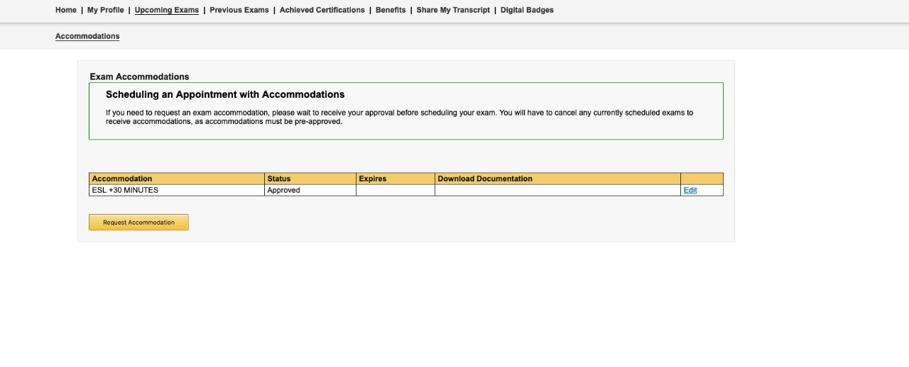
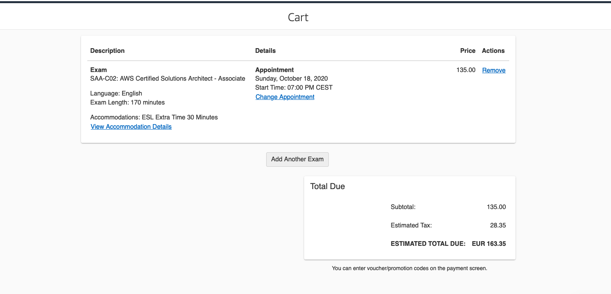

# Resources to learn and get the AWS certifications

## AWS Samples
https://github.com/aws-samples

### ProTips
If possible, create an independent aws root account for each domain: and you can apply for credits for each account, instead of 1 credit for the account.

* Use AWS Resource Groups > Tag Editor, to list all the resources in the account.

* Deactivate all the unused AWS Regions at IAM > Account settings

----

# ` AWS Cert Quiz | Review | Analysis | Community ` 

The best resources are those that AWS provides in
 
https://www.aws.training/LearningLibrary
 
https://explore.skillbuilder.aws/learn/

i.e

* This is my **Architecture** playlist https://youtube.com/playlist?list=PLhr1KZpdzukdeX8mQ2qO73bg6UKQHYsHb

* __AWS Well-Architected__  https://explore.skillbuilder.aws/learn/course/external/view/elearning/2045/aws-well-architected

* AWS Well-Architected Tool at https://www.aws.training/Details/eLearning?id=41984

* Exam Readiness: AWS Certified Solutions Architect – Associate (Digital) at https://www.aws.training/Details/Curriculum?id=20685

* Exam Readiness: AWS Certified Solutions Architect – Professional at https://www.aws.training/Details/eLearning?id=34737

* Advanced Testing Practices using AWS DevOps Tools at https://www.aws.training/Details/eLearning?id=59874

Also, you can see the streamings about the Exam review at

CQ Portal | Exam Review
The AWS Architects answer the AWS certification exam in the Stream!!! there are many things 
https://www.youtube.com/c/CQJohn/videos

https://www.twitch.tv/aws

## ` Official Guides, WhitePapers, FAQ's and Tech Documentation `

https://docs.aws.amazon.com/

i.e for VPC

* https://docs.aws.amazon.com/vpc/latest/userguide/what-is-amazon-vpc.html

* https://aws.amazon.com/vpc/faqs/

* https://docs.aws.amazon.com/whitepapers/latest/aws-vpc-connectivity-options/introduction.html

## ` Non Official Guides / Notes / 101 / AWS Sheets `

https://github.com/open-guides/og-aws
 
The Open Guide to Amazon Web Services

https://digitalcloud.training/certification-training/aws-solutions-architect-associate/
 
Note: the AWS test on this course is really accurate with the REAL AWS test.

https://tutorialsdojo.com/aws-cheat-sheets/

i.e for ELB

https://digitalcloud.training/certification-training/aws-solutions-architect-associate/compute/elastic-load-balancing/

## ` Courses `

#### Free / AWS Cloud for Beginners
https://kodekloud.com/courses/aws-cloud-for-beginners/

#### Acloudguru Free Trial
https://learn.acloud.guru/course/aws-certified-solutions-architect-associate/dashboard

#### AWS Digital Cloud Platform
https://www.udemy.com/course/aws-certified-solutions-architect-associate-hands-on-labs/

## ` Labs | Get your Hands dirty | AWS Platform `

####  Free tier | Gain free, hands-on experience with the AWS platform, products, and services

https://aws.amazon.com/free/?all-free-tier.sort-by=item.additionalFields.SortRank&all-free-tier.sort-order=asc

#### Acloudguru Free Trial |  You can use the Playground to Practice with the AWS services https://acloudguru.com/pricing

https://help.acloud.guru/hc/en-us/articles/360001389256-AWS-Cloud-Sandbox

#### You can simulate the AWS Platform in your Local!!!! with Docker!!!
LocalStack provides an easy-to-use test/mocking framework for developing Cloud applications. It spins up a testing environment on your local machine that provides the same functionality and APIs as the real AWS cloud environment. 

https://localstack.cloud/

## ` Practice Exam`

The best official mock test is the official `Practice exam` provide by AWS.

#### Make the official questions example and the exam guide

https://aws.amazon.com/certification/certified-solutions-architect-associate/

#### Third Party portals

https://explore.skillbuilder.aws/learn/course/external/view/elearning/9153/aws-certification-official-practice-question-sets-english

https://portal.tutorialsdojo.com/courses/aws-certified-solutions-architect-associate-practice-exams/

The Digital Cloud Platform and the acloudguru also provide practice exam, but in my experience, the best and more similar to the real test is the Digital Cloud Platform.

## ` How to book the exam and request the 30 minutes accommodation request`
The ESL+30 accommodation provides 30 minutes extra for all non native-speakers of the exam language. 
Before to book your AWS Test, you need to request the ESL + 30 accommodation. The ESL30 must be request before schedule the test, in other case you will require to cancel and book it again. 

### ` Book and Take your Exam | The force is with you!~ Good Luck `
* again, before to book your test get the ESL+30 to get 30 minutes extra in your exam.
* you can only can reschedule your exam 2 times, 24 before your date ( if not, that will be cancel and lost your money ) 
* you can cancel it and get your money back!~ 
https://tutorialsdojo.com/how-to-book-and-take-your-aws-certification-exam-online-saa-c02/

