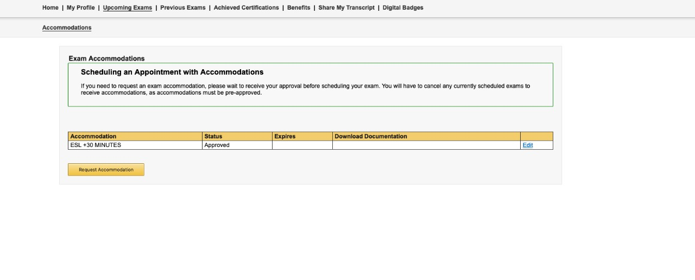
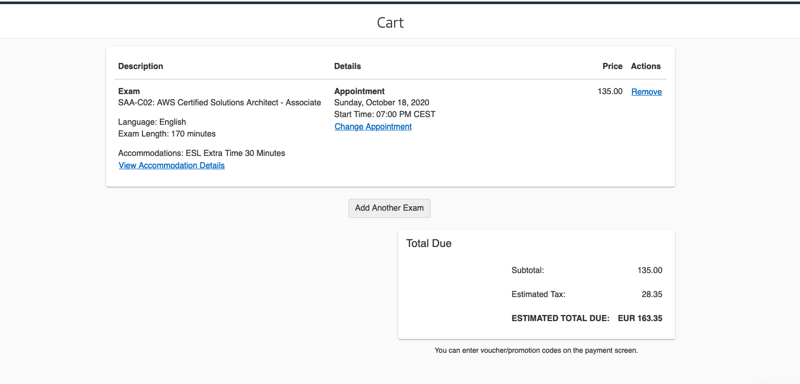

# Resources to learn and get the AWS certifications

## ` AWS Cert Quiz | Review | Analysis | Community ` 

The best resources are those that AWS provides in the `AWS Trainining` at 
https://www.aws.training/LearningLibrary

i.e

* AWS Well-Architected Tool at
https://www.aws.training/Details/eLearning?id=41984

* Exam Readiness: AWS Certified Solutions Architect – Professional at https://www.aws.training/Details/eLearning?id=34737

* Advanced Testing Practices using AWS DevOps Tools at https://www.aws.training/Details/eLearning?id=59874

CQ Portal | Exam Review
https://www.youtube.com/c/CQJohn/videos

https://www.twitch.tv/aws

## ` Official Guides, WhitePapers, FAQ's and Tech Documentation `

https://docs.aws.amazon.com/

i.e for VPC

* https://docs.aws.amazon.com/vpc/latest/userguide/what-is-amazon-vpc.html

* https://aws.amazon.com/vpc/faqs/

* https://docs.aws.amazon.com/whitepapers/latest/aws-vpc-connectivity-options/introduction.html

## ` Non Official Notes / 101 / AWS Sheets `

https://digitalcloud.training/certification-training/aws-solutions-architect-associate/

https://tutorialsdojo.com/aws-cheat-sheets/

i.e for ELB

https://digitalcloud.training/certification-training/aws-solutions-architect-associate/compute/elastic-load-balancing/

## ` Courses `

#### Acloudguru Free Trial
https://learn.acloud.guru/course/aws-certified-solutions-architect-associate/dashboard

#### AWS Digital Cloud Platform
https://www.udemy.com/course/aws-certified-solutions-architect-associate-hands-on-labs/

## ` Labs | Get your Hands dirty | AWS Platform `

####  Free tier | Gain free, hands-on experience with the AWS platform, products, and services

https://aws.amazon.com/free/?all-free-tier.sort-by=item.additionalFields.SortRank&all-free-tier.sort-order=asc

#### Acloudguru Free Trial |  You can use the Playground to Practice with the AWS services https://acloudguru.com/pricing

https://help.acloud.guru/hc/en-us/articles/360001389256-AWS-Cloud-Sandbox

#### You can simulate the AWS Platform in your Local!!!! with Docker!!!
LocalStack provides an easy-to-use test/mocking framework for developing Cloud applications. It spins up a testing environment on your local machine that provides the same functionality and APIs as the real AWS cloud environment. 

https://localstack.cloud/

## ` Practice Exam`

The best official mock test is the official `Practice exam` provide by AWS.

#### Make the official questions example and the exam guide

https://aws.amazon.com/certification/certified-solutions-architect-associate/

https://portal.tutorialsdojo.com/courses/aws-certified-solutions-architect-associate-practice-exams/

The Digital Cloud Platform and the acloudguru also provide practice exam, but in my experience, the best and more similar to the real test is the Digital Cloud Platform.

## ` How to book the exam and request the 30 minutes accommodation request`

Before to book your AWS Test, you need to request the ESL + 30 accommodation

### ` Book and Take your Exam | The force is with you!~ Good Luck `
https://tutorialsdojo.com/how-to-book-and-take-your-aws-certification-exam-online-saa-c02/

